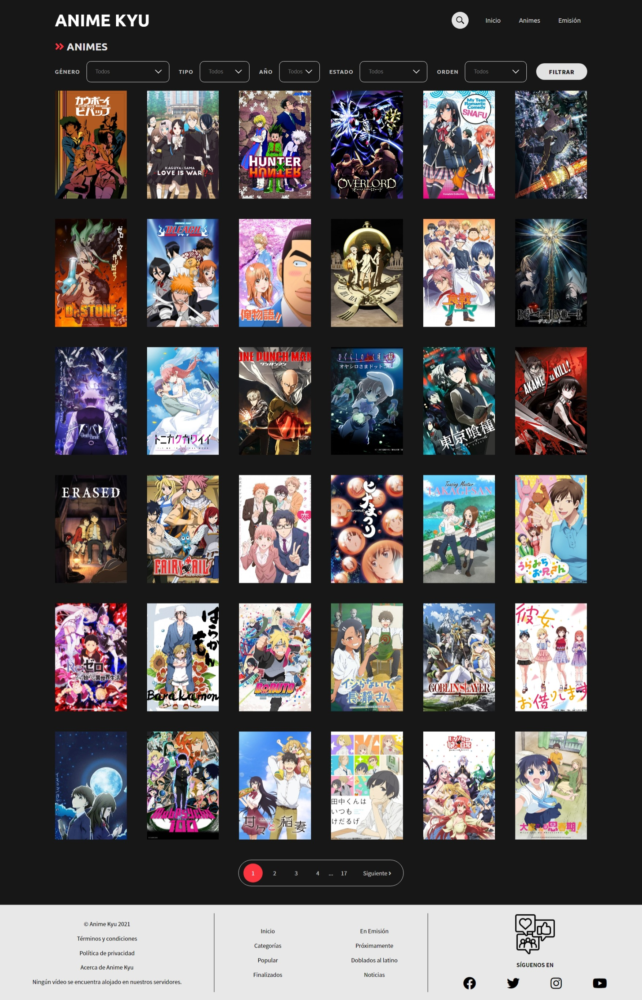
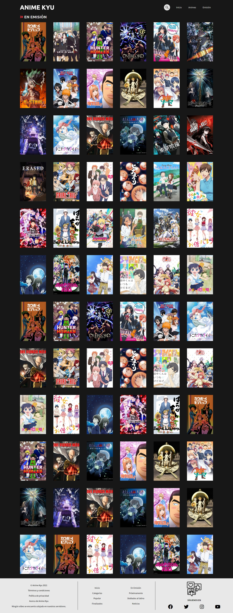
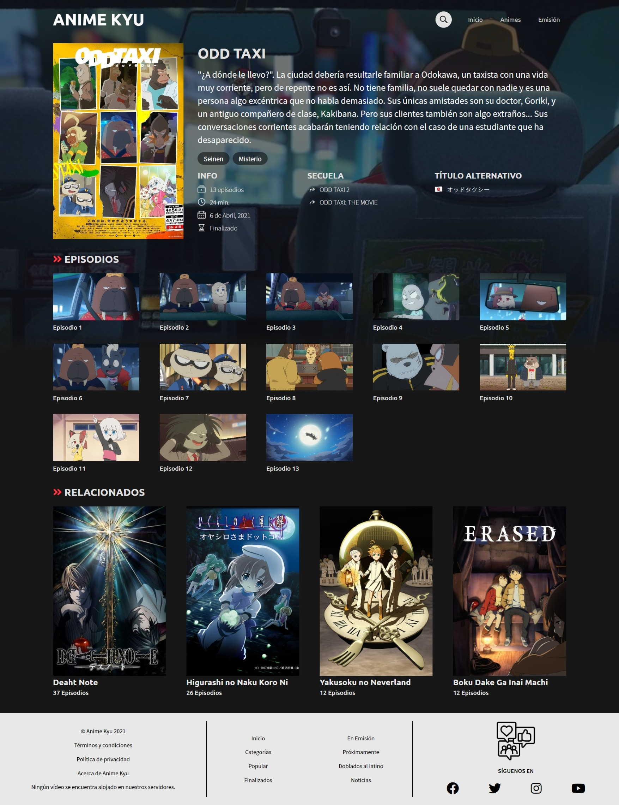
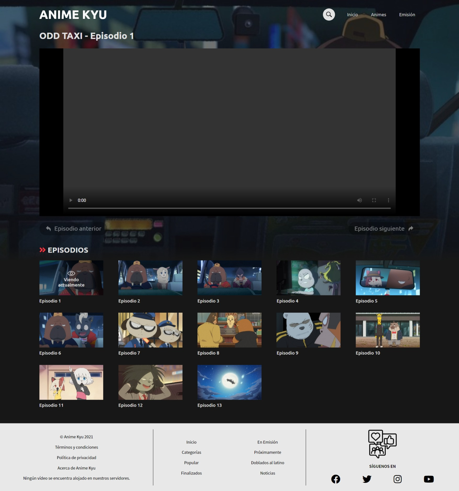
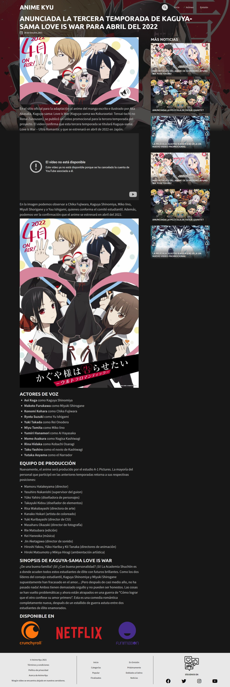

# Anime Kyu
Página web estática anime inspirada en JKanime, AnimeFLV, Otakustv y AnimeID.

## Tecnologías
Esta página web fue realizada con las siguientes tecnologías:
- HTML5
- CSS3
- JavaScript

## Secciones
Esta página web contiene 3 secciones principales: **Inicio**, **Animes** y **Emisión**. Además de contar con otras secciones como **Ver Episodio**, **Ver Información del Anime** y **Ver Noticia**.

### Inicio
#### En esta sección verás los episodios recientes que han sido subidos, el anime del día y anime de la semana, y noticias relacionadas al anime y manga.

### Animes
#### En esta sección podrás ver los animes que hay en esta página web, cuenta con una paginación y además también podrás filtrarlos por género, tipo, año, estado y orden.

### Emisión
#### En esta sección están todos los animes que están actualmente en emisión.

### Ver Información del Anime
#### En esta sección está la información del anime, como por ejemplo, su sinopsis, qué género tiene, cantidad de episodios, duración de cada episodio, fecha de estreno, si está finalizado o en emisión, sus secuelas o precuelas y los títulos alternativos, además cuenta con la opción de ver el trailer del anime y por último los animes similares a este. En esta ocasión, he puesto de ejemplo el anime de Odd Taxi.

### Ver Episodio
#### En esta sección se verá el episodio, además de los capítulos siguientes o anteriores a este. En esta ocasión, he puesto de ejemplo el Episodio 1 de Odd Taxi.

### Ver Noticia
#### En esta sección está la noticia a leer del anime o manga. Además cuenta con una mini sección para ver más noticias. En esta ocasión, he puesto una noticia del anime de Kaguya-sama: Love Is War.

